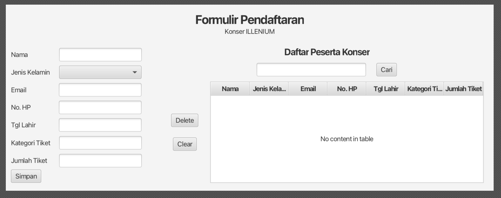

# Aplikasi Formulir Pendaftaran Konser

Sebagai awalan (starting-pack) yang akan kalian gunakan untuk membuat tugas besar.

## Fitur yang sudah dibuat
- Bisa menyimpan data peserta ke Database

## TODOs
- Memberikan background color atau image pada aplikasi
- Berikan style pada komponen-komponen yang digunakan sehingga menghasilkan UI yang lebih baik lagi
- Tambahkan fitur Edit data peserta
- Tambahkan fitur Delete untuk menghapus data peserta
- Tambahkan fitur untuk menampilkan data peserta di tabel. Jika kalian mengimplementasikan pagination, maka akan ada nilai plus.
- Tambahkan fitur pencarian. Tips, tambahkan index di kolom nama_peserta, agar proses pencarian cepat
- Tambahkan fitur Print untuk mencetak data peserta
- Tambahkan tombol Exit untuk keluar dari aplikasi
- Buat buku pengguna (manual book) dari aplikasi yang telah kalian buat. Minimal 25 halaman menggunakan template (TODO) [ini]()

## Tugas teman - teman
Tugas kalian adalah menyelesaikan semua TODO tersebut! Jika bingung, jangan ragu untuk bertanya ya teman - teman. Saya siap meet dan ajarkan langsung, kalau kalian bingung.

## Sebelum Mengerjakan
Sebelum mengerjakan pastikan teman - teman sudah menginstall [SceneBuilder](https://gluonhq.com/products/scene-builder/) ya. Jika bingung silahkan tanyakan saja ya!
